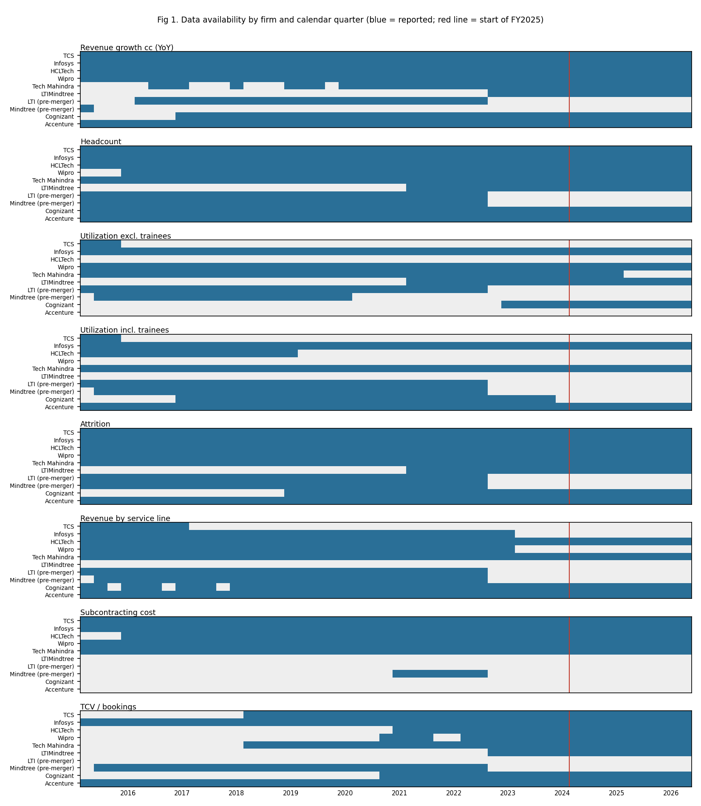

# AUDIT — public-data coverage for Indian IT-services headcount analysis

**Scope.** 6 Indian firms (TCS, Infosys, HCLTech, Wipro, Tech Mahindra, LTIMindtree, plus pre-merger LTI and Mindtree), 2 comparators (Cognizant, Accenture). Calendar 2015Q2 – 2026Q2 (Indian Q1FY16 – Q1FY27; Accenture Q3FY15 – Q3FY26; Accenture's Q4FY26 comes out 1 Oct 2026), plus the GFC window 2007Q1–2012Q1 (§5).
**Raw data.** 80k rows in `data/raw/<firm>.csv` and `gfc.csv`, each with a primary-source URL. Every vintage is kept, i.e. the same quarter as printed in each later release. The tidy panel (`data/tidy/panel_long.csv`) keeps the latest vintage. It has 37k firm × quarter × metric × dimension cells, and 1,023 of them were restated across vintages.
**Sources.** IR fact sheets and data sheets, earnings releases, SEC EDGAR (Infosys/Wipro 6-K and 20-F; Cognizant/Accenture 8-K, 10-Q and 10-K), and SEBI/NSE results filings. Company-hosted call transcripts are used only for metrics disclosed nowhere else (Accenture utilization/attrition/GenAI, some TCV). No news or aggregator figure is used as data.

## 1. Coverage matrix

Cell = share of quarters with data, **FY16-onward / recent window (2024Q2–2026Q2, 9 quarters)**. "—" = never reported in the period. Pre-merger LTI/Mindtree show one share (their series end in 2022Q3). The full firm × metric table with first and last quarters is in `output/coverage_matrix.csv`; the quarter-by-quarter view is Fig 1.

| metric | TCS | Infosys | HCLTech | Wipro | TechM | LTIM | LTI | Mindtree | Cognizant | Accenture |
|:--|:--|:--|:--|:--|:--|:--|:--|:--|:--|:--|
| Revenue USD | 100/100 | 100/100 | 100/100 | 100/100 | 100/100 | 100/100 | 100 | 100 | 100/100 | 100/100 |
| Revenue growth cc (YoY) | 100/100 | 100/100 | 100/100 | 100/100 | 73/100 | 71/100 | 87 | 3 | 84/100 | 100/100 |
| Revenue growth cc (QoQ) | 53/44 | 100/100 | 100/100 | 100/100 | 80/100 | 100/100 | 87 | 40 | — | — |
| Revenue by vertical | 100/100 | 100/100 | 100/100 | 100/100 | 100/100 | 100/100 | 100 | 97 | 100/100 | 100/100 |
| Revenue by geography | 100/100 | 100/100 | 100/100 | 100/100 | 100/100 | 100/100 | 100 | 97 | 100/100 | 100/100 |
| **Revenue by service line** | 18/**0** | 71/**0** | 100/100 | 71/**0** | 100/100 (IT vs BPS only) | — | 100 | 97 | 93/100 (2 lines) | 100/100 (2 lines) |
| Headcount | 100/100 | 100/100 | 100/100 | 93/100 | 100/100 | 100/100 | 100 | 100 | 100/100 | 100/100 |
| Net additions | 84/33 | 36/0 | 56/100 | — | — | — | — | 63 | 38/78 | — |
| Fresher hires | 24/0 | — | 44/100 | — | — | — | — | — | — | — |
| Attrition | 100/100 | 100/100 | 100/100 | 100/100 | 100/100 | 100/100 | 100 | 100 | 67/100 | 100/100 |
| **Utilization excl. trainees** | 7/**0** | 100/100 | **—** | 100/100 | 89/44 | 100/100 | 100 | 63 | 31/100 | — |
| Utilization incl. trainees | 7/0 | 100/100 | 36/0 | — | 100/100 | — | 100 | 97 | 62/0 (offshore) | 100/100 |
| Subcontracting cost | 100/100 | 100/100 | 93/100 | 100/100 | 100/100 | — | — | 23 | — | — |
| TCV / bookings | 73/100 | 100/100 | 49/100 | 47/100 | 73/100 | 71/100 | — | 97 | 51/100 | 100/100 |
| Client buckets | 100/100 | 100/100 | 100/100 | 100/100 | 100/100 | 100/100 | 100 | 100 | 13/0 | 29/100 |
| Onsite/offshore mix | — | 100/100 | — | 100/100 | 100/100 | 100/100 | 100 | 80 | — | — |
| AI disclosure (any number) | 7/33 | 7/22 | 9/44 | 16/44 | 4/22 | — | — | — | 7/22 | 22/78 |

## 2. Key gaps

1. **Utilization is missing for the two largest-by-headcount firms (TCS, HCLTech) in the recent window.** TCS stopped reporting it after Q3FY16 and HCLTech after Q4FY19; no later call transcript gives a number. Cognizant's measure changes in 2023/24 (offshore → blended). TechM's excluding-trainees measure stops after FY25; its including-trainees series is used instead. Recent-window utilization is therefore available for 6 of 8 firms: Infosys, Wipro, TechM, LTIM, Cognizant, Accenture.
2. **Service-line revenue has effectively disappeared for Indian firms.**
   - TCS stopped after Q4FY17, Infosys after Q4FY18, Wipro after Q4FY23; LTIMindtree never reported it.
   - In the recent window only 4 firms have any split, all coarse:
     - HCLTech: IT & Business Services / Engineering and R&D / Software
     - TechM: IT / BPS
     - Cognizant: Consulting & Technology / Outsourcing
     - Accenture: Consulting / Managed Services
   - This is the metric most directly tied to AI task exposure.
3. **No firm reports price, rate cards, billed hours or effort volume** in the recent window. Infosys' onsite/offshore person-months stop after Q4FY18. **p and Q are never separately observed.**
4. **Deal value (TCV) definitions differ by firm** (large deals only vs all deals, net-new vs incl. renewals). Before about 2019–21, figures are often hand-entered from calls. The series is very noisy: the YoY residual s.d. of trailing-12-month TCV is about 22%.
5. **Fresher hiring:** only HCLTech reports it consistently (from FY22). TCS stopped after FY18, and the others don't report it.
6. **Subcontracting cost:** available for 5 Indian firms (not LTIMindtree, which has only 9 Mindtree quarters) and neither comparator. It is an INR cost line; the share of revenue is computed in `01_build_tidy.py`. TCS's line switches to an expense-by-nature definition at Q1FY27, a break.
7. **AI revenue:** quantitative AI revenue exists only for:
   - Accenture: GenAI bookings/revenue, Q4FY23–Q1FY26, then discontinued
   - HCLTech: advanced-AI revenue from Q2FY26
   - TCS: AI run-rate from Q3FY26
   - Infosys: AI share of revenue, Q3FY26 and Q1FY27

   That is 1–4 quarters per firm, too short for any time-series use.

## 3. Definitional breaks (details in `data/raw/<firm>_NOTES.md`)

| firm | break | quarter | handling |
|--|--|--|--|
| TCS | service lines dropped; vertical recasts (FY18 "Regional Markets", FY20, FY24 "Consumer Business") | Q1FY18; Q1FY20; Q2FY24 | vertical growth rates used as reported; mapped to 4 broad groups |
| TCS | subcontracting line moves to expense-by-nature | Q1FY27 | flagged; one quarter only |
| Infosys | attrition definition changes 3× (LTM excl. subs → annualized → voluntary annualized → voluntary LTM, IT services) | FY16, FY21, FY22 | attrition not used in the model |
| Infosys | vertical reorganization (8 segments, FY18 restated) | Q1FY19 | as above |
| HCLTech | FY ended June until FY15; FY16 was a 9-month transition year | 2015–16 | calendar mapping by period_end |
| HCLTech | service lines → segments (ITBS/ERS/Products & Platforms); software moved to HCLSoftware; mix switched to Services level | Q1FY20; Q1FY23 | pre-FY20 ER&D stored under a separate name (not comparable) |
| HCLTech | divestiture removed 7,398 employees | Q1FY25 | headcount YoY base adjusted by the reported number (D10) |
| HCLTech | attrition IT-services LTM → company LTM excl. BPO; utilization discontinued | Q1FY20; after Q4FY19 | — |
| Wipro | headcount definition ("IT services head count" → "employee count", ~16k lower) | Q4FY17 | new series only from Q4FY16 (no splice) |
| Wipro | IT services segment perimeter (ISRE out Q3FY19, back Q1FY25); Capco acquisition | Q3FY19, Q1FY25; Q1FY22 | revenue growth used as reported (includes inorganic) |
| Wipro | geography and vertical reorganizations (6 vertical, 4 geography changes) | various | broad grouping |
| TechM | vertical reclassifications | Q1FY22, Q1FY24, Q4FY25 | broad grouping |
| TechM | onsite/offshore mix switches from revenue to headcount basis | Q1FY23 | not used |
| LTIMindtree | merger; combined restated data only from Q1FY22; combined headcount ~3% below LTI+Mindtree sum; utilization definitions differ | Q3FY23 (restated to Q1FY22) | **no splice**: LTI and Mindtree enter calibration as separate firms; LTIM only from Q1FY22 (D9) |
| Cognizant | segment renames; ASC 606; bookings definition; attrition definition (2023, 2026 with recast); utilization offshore → blended; Belcan acquisition (~4pp growth, 2024Q4–2025Q2) | 2017Q1; 2018; 2021Q4; 2023Q1/2026Q1; 2024Q1; 2024Q3 | utilization YoY computed within each series; Belcan not adjusted (D12) |
| Accenture | ASC 606 (revenue incl. reimbursements from FY19); geography reorganized 4×; Outsourcing → Managed Services; GenAI → "Advanced AI" | Q1FY19; FY18/20/24/25; Q1FY23; Q1FY26 | cc growth as reported; type-of-work series treated as continuous |

## 4. Access log

- **Blocked but obtained another way:**
  - tcs.com: HTTP 403 to scripts; PDFs downloaded through the in-app browser.
  - infosys.com: 403; archived copies of the original PDFs taken from web.archive.org, with the original URL recorded.
  - investors.cognizant.com: 403; SEC EDGAR used instead.
- **Blocked with no alternative needed:**
  - BSE API: "Access Denied".
  - web.archive.org was down during the LTIMindtree collection; NSE filings used instead.
- **Nothing required a login or payment.** Paywalled transcript sites (Seeking Alpha etc.) were not used.
- **Image-only PDFs** (TechM, HCLTech SEBI filings, Cognizant slide images) were OCR'd or hand-entered. Those values are flagged `hand-entered` in `notes` and were checked against other vintages.
- **Spot checks:** each collection agent re-checked ≥10 random values against the source text; all matched after one parsing fix (LTI Q4FY19).

## 5. GFC window (2007–2012)

The data are in `data/raw/gfc.csv` (11.3k rows; notes in `gfc_NOTES.md`). EDGAR supplied Infosys, Wipro, Cognizant and Accenture. web.archive.org copies of the companies' own PDFs supplied TCS, HCLTech and TechM (tcs.com and BSE blocked scripts). Quarters covered, out of 21 (2007Q1–2012Q1):

| metric | TCS | Infosys | HCLTech | Wipro | TechM | Cognizant | Accenture |
|--|--|--|--|--|--|--|--|
| Revenue USD | 21 | 21 | 21 | 21 (total, not IT Services) | 21 | 21 | 21 |
| cc growth | 2 | 21 | ~18 | 2 | — | — | 21 |
| Headcount | 21 | 21 | 21 | 21 | 21 | 18 | 16 |
| Utilization | 21 | 21 | 21* | ~14 | 21 | — | 17 |
| Attrition | 21 | 21 | 21 | 6 | 12 | 21 | 21 |

\*HCLTech GFC utilization is reported only for its software-services business (offshore/blended), not company-wide, so it isn't used in Part 2.

**Breaks:**
- Wipro: IT Services perimeter changed in Q1FY09.
- Infosys: US GAAP → IFRS in Q2FY09.
- HCLTech: June fiscal year; Axon consolidated from Dec 2008.
- TCS: e-Serve and Diligenta added to headcount in 2009Q1.
- TechM: Satyam not consolidated in this window.
- Accenture: Health & Public Service created in FY10.

**Verdict:** revenue, headcount and utilization are enough for a descriptive GFC signature (REPORT §3a). They are not enough for noise calibration: 2012Q2–2015Q1 is not collected, and definitions differ from the post-2015 data.

## 6. Feasibility verdict

| use | verdict |
|--|--|
| **Revenue (cc) × headcount decomposition**, all 8 firms, 2016–2026 | **Usable.** Complete for every firm, apart from gaps in cc growth for TechM and Mindtree before 2019. |
| **Utilization split of revenue per employee** | **Partly usable.** 6 of 8 firms in the recent window; missing for TCS and HCLTech, the largest firm and one of the three largest. Definitions differ across firms (including vs excluding trainees, IT services only), so only within-firm changes are comparable. |
| **Vertical / geography cross-section** | **Usable** after mapping to 4 broad vertical groups and 3 regions; reorganizations make fine-grained comparisons unreliable. |
| **Service-line (AI-exposure) cross-section** | **Barely usable.** 4 firms with 2–3 coarse lines each; no Indian pure-play split except HCLTech and TechM. Parts 2–4 use it only as one weak signal. |
| **Subcontracting (bears on S4)** | **Descriptive only.** 5 Indian firms, no comparators. |
| **Deal value** | **Usable but very noisy**; definitions not comparable across firms (used only as YoY within firm). |
| **Price vs volume** | **Not identified.** No public series separates p from Q. The residual of revenue per employee after utilization mixes price and labor intensity. |

**Bottom line.** Parts 2–4 are feasible for the aggregate identity (revenue, headcount, and utilization for 6 of 8 firms). The cross-sectional test in service lines, which is the most direct evidence on AI exposure, has to be scaled down to four firms with coarse splits. Per the brief, it is used as a weak signal and not worked around with assumptions.
