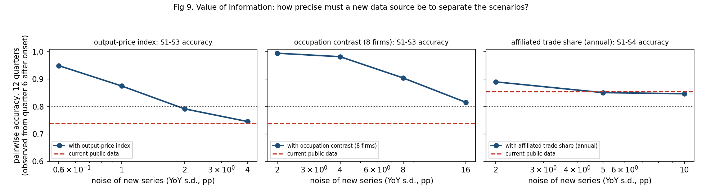

# NEXT STEPS — what to look at after the pilot, tested against user avatars

## 0. Summary

**Recommendation: a gated follow-on.** Spend the first ~25 RA-days on free work. Buy data only after a two-firm sample proves the paid source is precise enough.

- **What won't work.**
  - Public data alone cannot separate S1 (demand) from S3 (AI deflation passed into prices).
  - Hours and rate cards measure p/a, so they fail by construction (§3).
  - No official index prices IT services per unit of output.
  - H-1B filings are too noisy (§5).
- **What could work.**
  - Evidence on **where the cuts fall across roles** within firms, measured as role-level *headcount stocks*, across **16 firms** (the pilot's 8 plus 8 mid-tier). The simulation puts S1-vs-S3 accuracy at **0.94 after 8 quarters** if the within-firm role contrast has YoY noise ≤8pp.
  - It stays robust to confounds, exposure assumptions and 2× noise (0.81–0.94). It fails only if the true effect is as small as 2%/yr (0.78).
  - This requires paid role-level data. Its noise is unknown, which is exactly what the gate tests.
- **S4 (work moving to GCCs) stays weakly identified** under every design tested (≤0.91).
- **New descriptive facts from the probes** (not causal):
  - India's total software exports grew 7–8% a year in FY25–26, while the large listed vendors grew −1% to +6%. That counts against a pure industry-wide demand drop.
  - The shift toward GCC/multinational exporters continued, but more slowly than before 2023 (+1.6 vs +3.0 pp a year). That counts against S4 as a *new* shock.
  - Management language moved from "demand" (2023–24) to "productivity pass-through" and pricing (2025–26).
  - The junior share of headcount is falling faster than trend at Infosys and TCS, but fresher-hiring shortfalls are narrowing.

## 1. The complete user story

> **As** the research lead deciding whether to fund a 3–6-month follow-on project (one RA, modest data budget),
> **I want** to know which additional evidence would let us tell a demand drop (S1) apart from AI-driven labor savings passed into prices (S3), and work moving to client captives (S4) apart from both,
> **so that** I commit resources only if identification is actually attainable, and know in advance what result would change my mind.

**Acceptance criteria.** The follow-on is "worth doing" only if all four hold:
1. **AC1 (identification).** A pre-specified design reaches **≥80% pairwise accuracy for S1 vs S3** within **8 quarters** of observation, in the calibrated simulation, at the *measured* noise of the new data. The pilot achieves 0.71 at 8 quarters with Part-4 timing.
2. **AC2 (robustness).** AC1 still holds under the top-5 pilot judgment calls (DECISIONS.md), and under the most plausible confound for the new data.
3. **AC3 (feasibility).** The data are legally obtainable and have ≥6 years of pre-2023 history for noise calibration. Cost is ≤60 RA-days plus ≤$10k of data.
4. **AC4 (falsifiability).** The key test, and what would count against S3, can be written down *before* looking at post-2023 data.

## 2. Avatars (used to screen ideas before committing)

| avatar | role | decision they make | moved by | rejects |
|--|--|--|--|--|
| **Priya** | research lead / funder (primary user) | fund the follow-on or stop | a credible path to AC1–AC4 at a known cost | descriptive colour that can't change the S1-vs-S3 answer |
| **Marcus** | sell-side IT-services analyst | keep or revise the "AI deflation" call each quarter | timely (≤1 quarter lag), firm-level signals | annual data; anything with a 2-year lag |
| **Anjali** | labor economist advising on entry-level employment / skilling | where to target policy | *who* loses jobs (seniority, occupation), magnitudes | firm aggregates that can't say which workers |
| **Referee 2** | skeptical academic referee | accept or reject an identification claim | pre-registered tests, measurement validity, falsification | circular measures, cheap talk, forking paths |
| **Sam** | procurement head at a US bank (buys from all 8 firms) | none; truth-teller on mechanisms | — | data-to-concept mappings that ignore how deals are priced |

What Sam tells us up front, and why it matters:
- **Most offshore work is priced per FTE-month (time and materials) or as fixed-price managed services with annual productivity give-backs.** Under T&M, AI shows up as fewer billed hours at the same rate. This is why hours and rate cards cannot separate S1 from S3 (§3).
- **GCC insourcing typically takes stable "run" work.** That work is also the most AI-exposed, so S4 and S3 can load on the same tasks (confound ξ in §5).
- **H-1B filings are a lottery strategy.** Vendors file far more applications than they use.

## 3. The constraint every idea must pass (from the identity)

R = p·Q and billed effort = u·L = a·Q. Therefore:
- revenue per billed hour (rate cards) = p/a
- hours / person-months = a·Q

Under full pass-through (S3: p and a fall together), p/a is unchanged and a·Q falls exactly as it would under S1. **No vendor-side input, hours or rate data can separate S1 from S3.** The value-of-information simulation confirms this: adding a precise hourly-rate series leaves S1-vs-S3 accuracy at 0.74 (§5).

Only three kinds of evidence can separate them:
- **(i) prices per unit of *output*;**
- **(ii) where the cuts fall across tasks or occupations with different AI exposure;**
- **(iii) client-side output volumes.**

S4 needs **(iv) evidence on where the work went** (affiliated vs unaffiliated trade; GCC headcount).

## 4. Candidate ideas and first-pass avatar screen

Key: ✔ changes their decision · ◐ partly · ✘ no. The last column records whether the idea goes to a probe.

| # | idea | channel (§3) | Priya | Marcus | Anjali | Referee 2 | Sam | → |
|--|--|--|--|--|--|--|--|--|
| C1 | Official output-price indices (BLS PPI 5415, ONS SPPI, BEA custom-software deflator) | (i) | ◐ | ✔ monthly | ✘ | ◐ is it per hour or per deliverable? is the deflator input-cost based (circular)? | "PPI samples US establishments, not offshore rate cards" | **probe** |
| C2 | H-1B LCA filings: firm × occupation × quarter, crossed with occupation AI-exposure scores | (ii) | ✔ | ◐ quarterly, ~1q lag | ✔ occupations, wage levels | ◐ LCAs ≠ hires; H-1B policy shocks load on junior/low-wage roles | "lottery strategy" | **probe + validation test** |
| C3 | BEA affiliated vs unaffiliated imports of computer services from India; RBI export survey | (iv) | ✔ only direct S4 test | ✘ annual | ◐ | ◐ affiliated ≠ only GCCs; cost-plus valuation | "that's where GCC work shows up" | **probe** |
| C4 | Workforce composition: BRSR age bands, fresher hiring, Naukri JobSpeak by experience | (ii) weak | ◐ | ◐ | ✔ | ✘ as identification: S1 hiring freezes also hit juniors; only persistence discriminates | — | **probe** (for Anjali) |
| C5 | Public-procurement renewals (UK/EU/US): price per scope over time | (i) | ◐ | ✘ | ✘ | ✔ direct, but selected sample | "government deals rarely re-price for AI" | **quick feasibility** |
| C6 | Earnings-call text (pricing, productivity pass-through, demand, GCC terms) | onset dating | ◐ pins onset ex ante | ✔ | ✘ | ◐ cheap talk, but OK to pre-specify onset if fixed blind | "give-backs are real and discussed" | **probe** |
| C7 | Paid role-level workforce data (Revelio / LinkedIn) by firm × role | (ii) strong | ✔ | ✔ | ✔ | ✔ if the method is documented | — | **no probe** (paid): priced as an option |
| C8 | GCC headcount (NASSCOM-Zinnov reports; MCA filings of GCC entities) | (iv) | ◐ | ✘ | ◐ | ✘ consultancy estimates are not data; MCA filings are paid per document | — | **cut** (context only) |
| C9 | Client-side disclosures (large US/EU banks' India headcount) | (iii)/(iv) | ✘ sparse | ✘ | ✘ | ✘ anecdotal | — | **cut** |
| C10 | More firms (mid-tier Indian, EPAM, Globant, Capgemini) with varied exposure and service-line splits | (ii) via firm heterogeneity | ✔ cheap | ✔ | ◐ | ◐ exposure must be pre-specified | — | **probe** (disclosure survey) |
| C11 | Pre-registration + out-of-sample test on quarters after the protocol is frozen | protocol | ✔ | ◐ | ◐ | ✔ required | — | **adopt** (no probe needed) |
| C12 | Billed hours / effort data, rate cards | — (a·Q, p/a) | ✘ | ◐ | ✘ | ✘ fails §3 | "rate cards don't move; hours do" | **cut** (§3) |
| C13 | Indian wage data (salary hikes) | cost side | ✘ | ◐ | ◐ | ✘ ambiguous sign under S1 vs S3 | — | **cut** |

## 5. Probe results (details and data in `data/explore/<topic>/FINDINGS.md`)

| idea | what the data actually measure | noise (YoY s.d., pre-2023) | key finding | verdict |
|--|--|--|--|--|
| C1 price indices | **No official p index exists.** BLS PPI does not cover NAICS 5415. The UK SPPI (J62) is priced from hourly charge-out rates, so it measures **p/a**. The BEA custom-software deflator is built from input costs plus assumed productivity (**circular**). GSA CALC rates are hourly. | UK J62 1.2; US management consulting 4.7 | Consulting price minus wages fell in 2025, but by less than 1 s.d. | **No**; keep UK J62 and ECI as cyclical controls (0.25 RA-days) |
| C2 H-1B LCA × occupation | requests (not hires) for the US-onsite slice, by occupation | occupation contrast per firm 15–112 (median ~55); pooled 14.5 | Validation against onsite staffing: r=0.32 (cases), 0.13 (positions). The recent contrast **flips sign** between two exposure scores (occupation recoding). The Sept-2025 fee swamps everything from 2025Q4. | **No.** Value of information at measured noise: S1–S3 0.74 → 0.76 |
| C3 trade (BEA, RBI) | no BEA India × affiliation split; proxies: affiliate-to-parent services (BEA multinationals data, cost-plus) and the RBI split by company type | quarterly exports 7.3; annual 4–6 | GCC-type share rising since FY14, **not accelerating** after FY23. Total exports far outgrew the large vendors in FY24–26. | **Conditional** (2 RA-days): annual S4 cross-check only |
| C4 workforce seniority | ESG/GRI age tables (all 6 Indian firms), Infosys job levels, fresher counts, JobSpeak postings | Infosys <30-share change 1.9pp; JobSpeak 23 | The <30 share fell at 5 of 6 firms, fastest where revenue grew. Pre-trend already −1.4 to −2 pp a year. Infosys junior headcount −47 log pts vs senior +22. | **Conditional yes** (2 RA-days): serves Anjali; low power (annual, 3 post years) |
| C5 procurement | contract value per notice (price × quantity; scope counts never stated); UK values are ceilings | n/a (~50–150 re-let pairs) | The Indian firms barely appear in US federal data. The same Infosys CQC scope went from ~£57k to ~£65k/month (2023–25 vs 2025–27). | **No** (8–15 RA-days for a noisy, selected panel) |
| C6 call text | per 10k words, pre-specified dictionary; 6 firms, 2018–26 | — | Demand-talk onset 2023Q1–Q4. Productivity-pass-through onset 2024Q1 (HCL) to 2025Q2 (TCS). Pricing talk doubles in 2026. | **Yes** (done): used to fix onset dates *ex ante* |
| C10 more firms | 16 firms surveyed | — | Mphasis (Apps/BPS/Infra + transaction-priced share), Hexaware 2010–20 (testing/IMS/BPS), IBM (Intelligent Ops) have clean exposure splits. LTTS and Cyient give a low-exposure engineering contrast. US/EU peers add little. | **Yes** (~15 RA-days) |

Correction to a probe's framing: Persistent's historical "revenue per billed person-month" is **p/a**, not an output price (§3).

## 6. Value of information (simulation calibrated on the pilot; `scripts/07_voi.py`, `output/voi_*.csv`)

**How precise must new data be?** (Fig 9) S1-vs-S3 accuracy at 12 quarters, observed from quarter 6 after onset (the Part 4 situation). Baseline with current public data: 0.74.

| added series | accuracy | condition |
|--|--|--|
| hourly rate p/a (control) | 0.74 | even at 1pp noise; §3 confirmed |
| output-price index | 0.95 / 0.88 / 0.79 | at 0.5 / 1 / 2 pp noise |
| output-price index, cyclical price response 0.5 | 0.74 | the gain **vanishes**: a demand drop lowers prices too |
| role/occupation contrast, 8 firms | 1.00 / 0.98 / 0.90 / 0.82 | at 2 / 4 / 8 / 16 pp noise |
| role/occupation contrast, demand confound ζ=0.3 | 0.94 | robust |
| affiliated trade share (annual) | 0.74 | leaves S1–S3 unchanged; moves S1–S4 only from 0.85 to 0.89 even at 2pp noise |

**Committed designs.** S1-vs-S3 accuracy after **8 quarters** (the acceptance-criterion horizon); S1-vs-S4 in brackets.

| design | base | narrow exposure spread | demand confound | noise ×2 | effect 2%/yr |
|--|--|--|--|--|--|
| A. current public data (8 firms) | 0.71 (0.84) | — | — | — | — |
| B. + 8 mid-tier firms (public) | 0.81 (0.85) | 0.77 | — | 0.69 | 0.66 |
| D. B + role-level contrast, noise ≤8pp, 16 firms (paid) | **0.94** (0.86) | 0.94 | 0.89 | 0.81 | 0.78 |
| E. B + role-level contrast, noise 16pp | 0.86 (0.86) | — | — | — | — |

- **B passes AC1 but fails AC2.**
- **D passes AC1 and AC2** except at the smallest effect size.
- **No design passes for S1 vs S4.**

## 7. Second avatar pass on the committed plan (§8)

| avatar | verdict | remaining objection | how the plan answers it |
|--|--|--|--|
| Priya | **go, gated** | "Don't let me buy data that turns out as noisy as LCA." | Gate 2: a two-firm sample must show role-contrast noise ≤8pp (≤16 acceptable only with all 16 firms) and validation r≥0.7 before any full purchase |
| Marcus | ◐ | "Annual trade and ESG data are useless to me." | Role data update monthly; the text index quarterly; the firm panel quarterly |
| Anjali | **yes** | "Role counts can't tell promotion from displacement." | Infosys job-level ladder and hires by age as a within-firm check; report flows as well as stocks |
| Referee 2 | ◐ → accept if pre-registered | "LinkedIn-type data under-represent junior offshore staff; O*NET exposure scores are US-based; S4 unresolved; small effects unidentified." | Validation vs reported headcount and Infosys job levels; two exposure scores pre-declared (Eloundou primary, Felten robustness); S4 stated as out of reach; the power statement includes the 2%/yr case |
| Sam | ◐ | "Vendor titles are inflated; 'Senior Systems Engineer' is a junior grade at Infosys." | Map roles by *function* (testing, support, development, consulting), not title seniority; check against firm grade ladders in Gate 2 |

## 8. Committed plan, with gates and kill criteria

| phase | work | cost | output | gate to next phase |
|--|--|--|--|--|
| **0. Freeze** (week 1) | Pre-registration: scenarios; metrics; onset dates from call text (demand 2023Q1; pass-through = median text onset 2024Q4); exposure classification (Eloundou primary, Felten robustness); calibration window; test statistics; decision thresholds. Out-of-sample = quarters released after the freeze (Q2FY27 onward). | ~5 RA-days, $0 | frozen protocol | — |
| **1. Public extension** (weeks 2–5) | 8 mid-tier firms through the existing pipeline, with firm exposure pre-specified from disclosed service mix; RBI/BEA S4 cross-check; ESG seniority tables; UK J62/ECI controls; re-run Parts 3–4 on 16 firms | ~20 RA-days, $0 | updated REPORT; out-of-sample test on new quarters | none (Phase 1 is worth doing alone: it answers B) |
| **2. Sample test** (weeks 5–7) | Role-level headcount for **Infosys and HCLTech**, 2015–2026, from a paid workforce-data vendor or a free research-access programme. Measure (i) total headcount vs reported: r ≥0.7; (ii) per-firm YoY high-minus-low-exposure role contrast, pre-2023 s.d.; (iii) role-to-exposure mapping vs Infosys job levels | ~5 RA-days + sample cost (vendor price not public; request a quote) | noise and validation numbers | **Go** if (i) holds and (ii) ≤8pp, or ≤16pp with all 16 firms (0.86–0.90 at 8q). **Stop** if (ii) >16pp or (i) fails: then S1 vs S3 is not identifiable at acceptable cost, and Phase 1 is the final answer. |
| **3. Full test** (weeks 8–14) | Role-level panel for 16 firms; pre-registered test; sequential S1→S3 model with text-dated onsets; out-of-sample evaluation | ~30 RA-days + licence (AC3 cap $10k) | S1-vs-S3 answer with stated power | — |

**Totals:** ~60 RA-days (AC3). Data spend is committed only after Gate 2.

**What we will not do, and why:**

| idea | reason |
|--|--|
| H-1B LCA panel | measured noise too high; validity weak |
| price indices as a p measure | none exists |
| procurement price panel | scope not fixed, small N |
| GCC consultancy headcounts | not data |
| billed hours / rate cards | measure p/a |

**What would change this plan:**
- a public output-price series with ≤1pp YoY noise and a cyclical response below ~0.3;
- firms resuming service-line or utilization disclosure;
- evidence that the true effect is ≤2%/yr. Then no affordable design separates S1 from S3 within 8 quarters, and the honest answer is "not identifiable".

