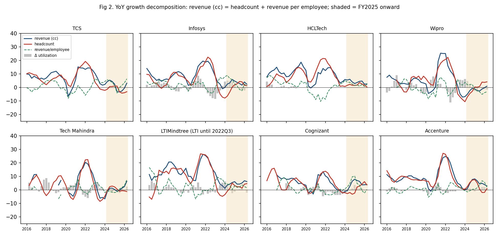
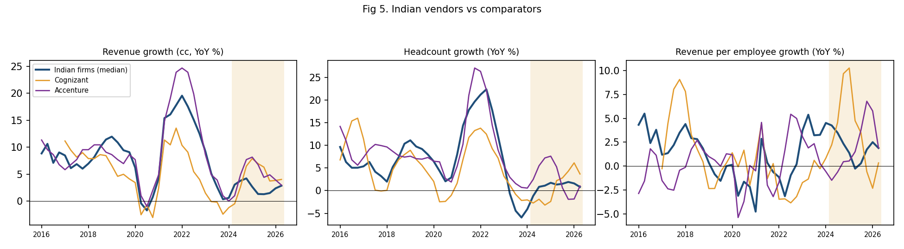
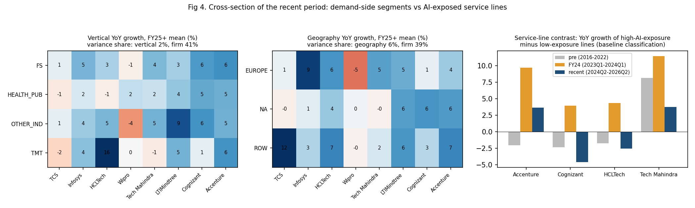
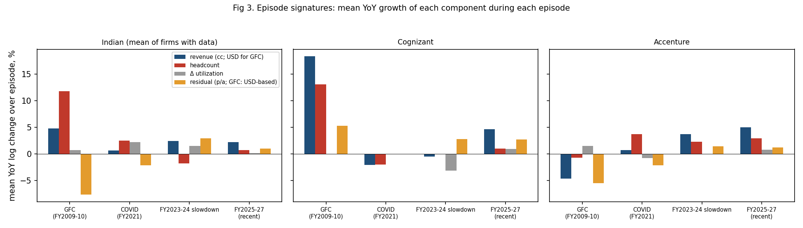
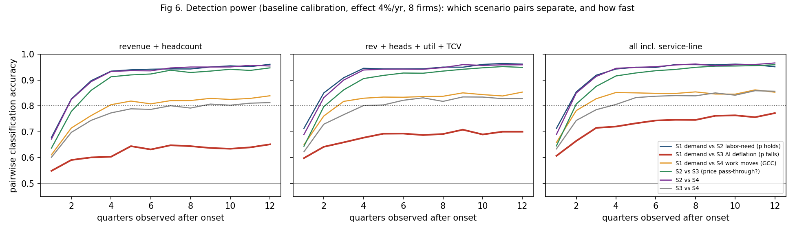
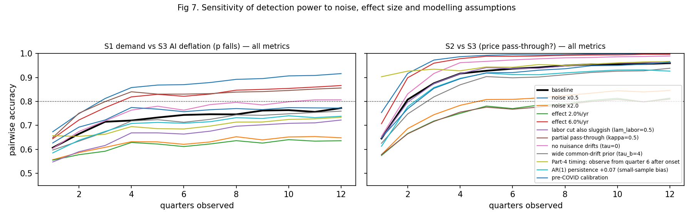
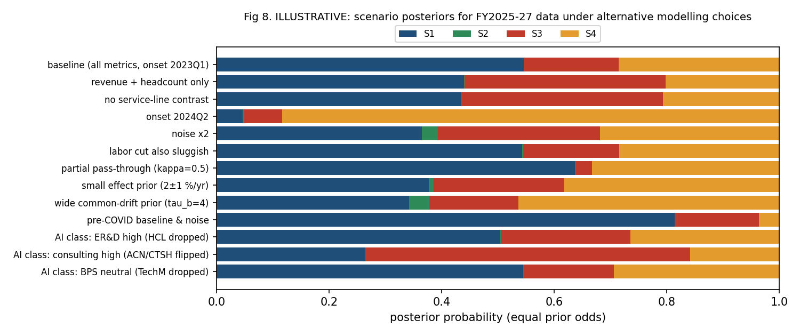

# Can public data tell why Indian IT-services headcount fell? — feasibility pilot

*Scope: TCS, Infosys, HCLTech, Wipro, Tech Mahindra, LTIMindtree; comparators Cognizant and Accenture. Quarterly data 2015–2026Q2 (Indian Q1FY27) from primary filings. Illustrative and descriptive; no causal claims.*

## 1. Verdict (read this first)

1. **Public data can separate "labor needs fell, prices held" (S2) from everything else, quickly.**
   - With revenue and headcount alone, the simulation reaches ≥95% pairwise accuracy within 2–3 quarters.
   - Applied to FY2025–27, **S2 gets ~0% posterior probability in every specification.**
   - Revenue per employee has not accelerated: Indian firms' mean YoY growth was +1.5% in FY25–27, against +0.9% (2015–22) or +1.7% (pre-COVID). A labor-saving shock with prices held would show up as faster revenue-per-employee growth.
2. **Public data cannot reliably separate a demand drop (S1) from AI-driven deflation passed into prices (S3).**
   - With full price pass-through, the two predict the same revenue and headcount paths.
   - Even with every public metric, the simulation plateaus at **~77% pairwise accuracy** and never reaches 80% within 12 quarters (65% with revenue and headcount only).
   - The only discriminating signals are the timing of utilization, the comparators' lower AI exposure, and a coarse service-line contrast available for 4 firms.
3. **"Work moves to client captives" (S4) is distinguishable from S1/S3 only through the comparators** (~85% accuracy after 3–4 quarters). That rests on the untestable assumption that Accenture and Cognizant don't lose work to GCCs too. Subcontracting data exist but are descriptive only.
4. **Applied to FY2025–27 (illustrative):**
   - The data are consistent with S1, S3 or S4.
   - The ranking flips with defensible choices: the AI-exposure classification of service lines, the onset date, and the calibration window.
   - **The sell-side S3 ("AI deflation") attribution is neither supported nor contradicted by public data.** The S3-vs-S1 log Bayes factor ranges from −3.1 to +0.8 across specifications. Without the service-line contrast it is about −0.2, i.e. uninformative.
5. **Time will not fix this.** Detection power plateaus after ~4–6 quarters, because persistent firm- and industry-specific drifts in demand don't average out. More quarters of the same metrics buy little.

**Implication for a full project:** it is worth doing only if it adds data that separate price per unit of *output* from volume, or data showing which kinds of task the cuts fall on. Hours and rate cards do not qualify; see the §6 correction. The ranked candidates are in `NEXT_STEPS.md`.

## 2. Data (details in AUDIT.md)

- **Collected:** 80k raw data points (incl. the GFC window) from ~1,200 distinct primary documents (fact sheets, SEC 6-K/8-K/10-Q/20-F, SEBI filings), each with a source URL. Nothing required a login.
- **Complete for all 8 firms:** revenue (reported and cc), headcount, attrition, vertical and geography mix.
- **Partial:** utilization is available for 6 of 8 firms in the recent window. **TCS stopped reporting it after FY16 and HCLTech after FY19.**
- **Service-line revenue — the most direct handle on AI exposure — has largely vanished:**
  - TCS stopped after FY17, Infosys after FY18, Wipro after FY23; LTIMindtree never reported it.
  - It survives only as coarse splits at HCLTech (IT&BS / ER&D / Software), TechM (IT / BPS), Cognizant (Consulting & Technology / Outsourcing) and Accenture (Consulting / Managed Services).
- **Missing entirely:** no firm publishes price, rate or billed-effort series, so **p and Q are never separately observed**.
- **Other gaps:** subcontracting cost exists for 5 Indian firms and neither comparator. Quantitative AI revenue exists for 1–4 quarters at 4 firms.

## 3. Historical decomposition (Part 2)

**Identity.** In YoY log changes: revenue growth (cc) = headcount growth + revenue-per-employee growth. Revenue per employee splits further into utilization change + a residual, where the residual = Δln p − Δln a. Price and labor-intensity changes are observationally mixed in that residual.



| mean YoY %, Indian firms | revenue cc | headcount | rev/employee | Δ utilization | residual (p/a) |
|--|--|--|--|--|--|
| 2015–22 (ex-COVID) | 12.2 | 11.8 | 0.9 | 0.2 | 2.0 |
| pre-COVID 2015–19 | 9.9 | 7.0 | 1.7 | 1.1 | 1.6 |
| COVID (2020Q2–Q4) | 0.6 | 2.5 | −1.8 | 2.2 | −2.2 |
| FY24 slowdown (2023Q1–2024Q1) | 2.4 | **−1.8** | **4.2** | 1.5 | 2.9 |
| FY25–27 (2024Q2–2026Q2) | 2.2 | 0.7 | 1.5 | 0.1 | 1.0 |
| *Accenture FY25–27* | *5.0* | *2.9* | *2.1* | *0.8* | *1.2* |
| *Cognizant FY25–27* | *4.6* | *1.0* | *3.6* | *0.9* | *2.7* |

**What the data are consistent with:**
- **The headcount decline is concentrated in FY24, not FY25–27.**
  - In FY24, Indian headcount fell ~2% YoY while revenue still grew ~2%. Utilization rose (+1.5 log points) and the residual jumped (+2.9).
  - This is the signature of absorbing slack after the FY22 hiring surge (headcount +20–30% YoY in 2021–22; Fig 2). It matches a demand normalization with labor hoarding unwinding. It is not a distinctive AI signature: the same pattern follows a hiring overshoot.
- **In FY25–27, revenue per employee grows at roughly its historical rate.** Headcount is roughly flat (+0.7%), while revenue growth is ~10 points below the 2015–22 average.
  - Within the identity, a slowdown this size with flat revenue per employee is what S1 (volume), S3 (price falls with labor needs) and S4 (volume moves elsewhere) all predict. S2 does not predict it.
  - Firm dispersion is large: Wipro −1.6% revenue and −1.5% revenue per employee; TCS revenue +1.1% and headcount −1.4%; LTIMindtree +5.1% revenue.
- **Past shocks.**
  - In the COVID shock (FY21), headcount kept growing and utilization rose, pushing the residual negative, with a small revenue drop.
  - FY24 shows the reverse sequence: headcount cut after the surge, with utilization and the residual rising.
  - The GFC signature (§3a) is different from both.
  - FY25–27 matches none of these: all components are quiet, and revenue growth is simply lower.
- **Comparators.** Before 2023, Indian median growth tracked Accenture closely (correlation 0.90 for revenue, 0.83 for headcount). In 2023–26 the correlations fall to 0.58 and 0.33.
  - Indian firms grew ~2–3 points slower than Accenture in FY25–27, versus about 1 point slower before 2023. A common-demand-only story (S1 hitting everyone equally) fits less well than one with an Indian-specific component. That component could be S4 (GCCs) or Indian vendors' higher exposure to AI-substitutable work (S3 with heterogeneous exposure).
  - Cognizant's recent growth includes ~4pp from the Belcan acquisition (2024Q4–25Q2), so its comparison is biased upward.



**Cross-sectional test (Fig 4).**
- **Verticals and geographies.**
  - Recent vertical growth is explained mostly by *firm* identity (41% of cross-firm × vertical variance) and hardly at all by vertical (2%).
  - The deceleration relative to 2017–19 has a modest geography component (22%): Europe and North America slowed more than the rest of world for several firms.
  - So declines do not line up by client industry across firms, which weakly argues against a pure industry-demand shock. Small n (24–32 cells) and 20+ segment reorganizations limit this test.
- **Service lines vs AI exposure** (baseline classification: run/maintain/BPO = high, consulting/ER&D = low). Relative to each firm's pre-2023 average, high-exposure lines slowed at:
  - Cognizant: −2.0 pts (biased by Belcan)
  - HCLTech: −0.8
  - TechM: −4.4 (noisy)
  - They *accelerated* at Accenture (+5.7). Managed Services outgrew Consulting as consulting demand fell.
  - With consulting classed as AI-exposed (alternative B), the Accenture and Cognizant signs flip. **Mixed, and classification-dependent.**



**Evidence bearing on S4 (descriptive).**
- Subcontracting cost as a share of revenue fell at every Indian firm from the FY22 peak to 2024 (e.g. HCLTech 15.0% to 13.0%, TechM 15.4% to 10.1%, TCS 10.0% to 4.7%).
- It has edged up since 2025 (HCLTech 14.8%, TechM 12.0%, TCS 6.0%, Infosys 8.5%), while headcount stayed flat or fell. That fits some substitution toward subcontractors, but levels remain below FY22.
- GCC headcount is not in any firm filing.

### 3a. GFC (FY2009–10) signature



- **Coverage.** The 2008Q3–2009Q4 window is covered for TCS, Infosys, HCLTech, TechM, Cognizant and Accenture. Wipro is dropped because its revenue perimeter changed in 2008. Only Infosys, HCLTech and Accenture report cc growth for this period, so revenue is shown in USD. USD strengthened sharply in 2008–09, so USD revenue growth understates cc growth.
- **Demand-shock pattern:**
  - Indian revenue growth collapsed from 25–30% YoY in 2007–08 to ~5% (USD).
  - Utilization dipped: Infosys troughed at −5.4 log points YoY, TechM −4.2, TCS −2.0.
  - Headcount growth slowed but stayed positive, at ~+12% on average.
  - Revenue per employee therefore fell (≈ −7% YoY in USD).
  - Accenture: revenue −0.5% cc (−4.7% USD), headcount −0.7%, utilization *up*. It trimmed staff faster.
- **Contrast with FY25–27.** The GFC signature is the textbook surprise-demand response in the model: utilization and revenue per employee fall first, headcount follows with a lag. FY25–27 shows neither the utilization dip nor falling revenue per employee.
  - A **sudden** demand drop like 2008–09 is therefore not what the recent data look like.
  - But at 6+ quarters after an onset, a *gradual* demand drift would also show no utilization dip. So this contrast rules out a GFC-style shock, not demand as such.
- **Caveats.** TCS (e-Serve/Diligenta, 2009Q1) and HCLTech (Axon, Dec 2008) acquisitions inflate headcount and revenue growth in this window.

## 4. Detection power (Part 3)

**Model** (`scripts/sim_model.py`). Each scenario is a persistent drift (% per year, starting at onset) in price p, volume Q or labor per unit a, mapped into YoY revenue, headcount, utilization, deal value, and the service-line contrast.
- **Timing:** surprise volume changes pass into headcount with partial adjustment, so utilization dips first. Anticipated labor-need changes (S2/S3) pass through immediately.
- **Nuisance drifts:** every scenario also allows a persistent common demand drift and firm-specific drifts, integrated out analytically.
- **Noise** (the part that matters most): calibrated from 2015Q2–2022Q4 excluding COVID quarters. Each metric's shocks are split into a component common to all firms and a firm-specific component, with cross-metric correlation, and each follows an AR(1) process.
  - YoY residual s.d.: revenue 3.7pp, headcount 5.5pp, utilization 2.7pp, TCV ~25pp, service-line contrast 7.5pp.
  - AR(1) ≈ 0.84–0.87 for revenue and headcount.
- **Simulation:** effect size 4%/yr (range 2–6), 2,000 Monte Carlo draws per cell, 8 firms, with each metric available only for firms that actually report it.

**Key table — pairwise accuracy at 12 quarters (quarters needed to reach 80%), baseline:**

| scenario pair | revenue only | revenue + headcount | + utilization + TCV | all incl. service-line | robust? |
|--|--|--|--|--|--|
| S1 demand vs **S2** labor need, p holds | 0.81 (10q) | **0.96 (2q)** | 0.96 (2q) | 0.95 (2q) | yes (≥0.82 in all sensitivities) |
| S2 vs **S3** (price pass-through) | 0.80 (10q) | **0.95 (3q)** | 0.95 (3q) | 0.96 (2q) | yes, except κ=0.5 (0.81, 10q) |
| S2 vs S4 | 0.86 (4q) | 0.95 (2q) | 0.96 (2q) | 0.97 (2q) | yes |
| S1 vs **S4** work moves (GCC) | 0.82 (5q) | 0.84 (4q) | 0.85 (3q) | 0.85 (3q) | fragile: fails at 2× noise or 2%/yr effect; depends on comparators being unaffected |
| S3 vs S4 | 0.79 (never) | 0.81 (7q) | 0.83 (4q) | 0.86 (4q) | fragile (same) |
| **S1 demand vs S3 AI deflation** | 0.58 (never) | **0.65 (never)** | 0.70 (never) | **0.77 (never)** | **not separable** except at 0.5× noise, 6%/yr effect, or partial pass-through |



- **Single metrics are weak.** Headcount alone, utilization alone or TCV alone never reach 80% for any pair (`output/key_table_compact.md`).
- **Four-way classification accuracy** (chance = 25%) plateaus at 69% with revenue and headcount and 76% with everything.
- **Sensitivity (Fig 7, `output/robustness_compact.md`).** S1–S3 accuracy moves as follows:
  - 0.77 at baseline
  - 0.65 with 2× noise
  - 0.64 with a 2%/yr effect
  - 0.87 with a 6%/yr effect
  - 0.86 with 50% pass-through
  - 0.73 when observing from quarter 6 after onset (the Part 4 situation)
  - 0.74 with the AR(1) coefficient corrected for its downward bias
  - 0.81 with no nuisance drifts
- **Which pairs stay indistinguishable with public data:** S1 vs S3 under all but optimistic assumptions. S1/S3 vs S4 if comparators are also exposed to GCC migration. Any pair at a 2%/yr effect, except those involving S2.



## 5. Applying the model to FY2025–27 (Part 4 — ILLUSTRATIVE)

**Setup:** onset at 2023Q1; observed quarters 2024Q2–2026Q2 (6–14 after onset); 258 firm-metric-quarter observations; deviations from each firm's 2015–22 mean; equal prior odds.

| specification | P(S1) | P(S2) | P(S3) | P(S4) | log BF S3:S1 |
|--|--|--|--|--|--|
| baseline (all metrics) | 0.55 | 0.00 | 0.17 | 0.29 | −1.2 |
| revenue + headcount only | 0.44 | 0.00 | 0.36 | 0.20 | −0.2 |
| no service-line contrast | 0.43 | 0.00 | 0.36 | 0.21 | −0.2 |
| AI class: consulting = high | 0.26 | 0.00 | **0.58** | 0.16 | +0.8 |
| onset 2024Q2 | 0.05 | 0.00 | 0.07 | **0.88** | +0.4 |
| pre-COVID baseline & noise | **0.81** | 0.00 | 0.15 | 0.04 | −1.7 |
| partial pass-through κ=0.5 | 0.64 | 0.00 | 0.03 | 0.33 | −3.1 |
| noise ×2 | 0.37 | 0.03 | 0.29 | 0.32 | −0.2 |



**Reading:**
- **S2 is rejected throughout.**
- **S1, S3 and S4 trade places** depending on choices the data cannot settle.
- **How much of the analysts' S3 attribution can public data support? Very little either way.**
  - The only evidence that bears on S3 specifically is the service-line contrast: 4 firms, 2–3 lines each.
  - Its direction depends on whether consulting counts as AI-exposed.
  - On aggregates alone the Bayes factor is ~1.
- **Posterior effect sizes:** 4.5–5.6%/yr under S1 or S3. The analysts' 3–5% deflation range is consistent with the data *if* S3 is assumed. The data do not favour assuming it.

## 6. What is and isn't identified; what would make the full project (not) worth doing

**Identified from public data:**
- Revenue vs headcount vs revenue per employee.
- Utilization for 6 of 8 firms.
- Whether revenue per employee accelerated. It did not, beyond FY24's utilization-driven jump, which rules out S2-type labor saving with prices held.
- Whether Indian firms diverged from comparators. They did, moderately, from 2023.

**Not identified:**
- Price vs volume (p vs Q). The residual of revenue per employee mixes price and productivity.
- Therefore S1 vs S3.
- GCC migration (S4) vs vendor-specific volume loss, beyond the comparator contrast.

**The full project is not worth doing if it only extends these public series.** Power plateaus within ~6 quarters. Service-line and utilization disclosure has been shrinking, not growing. Conclusions flip on a classification judgment.

**It becomes worth doing if at least one of these can be obtained.**

Correction (added after the pilot): billed effort = u·L = a·Q. So hours, person-months and revenue per billed hour (rate cards) measure a·Q and p/a, **not** Q and p. Under full pass-through, S1 and S3 produce identical revenue, effort and hourly-rate paths. Effort or rate data therefore sharpen the utilization split but **cannot** separate S1 from S3. What can:

1. **Prices per unit of *output*:**
   - fixed-price or managed-service pricing per unit of scope (per ticket, per transaction, per application)
   - output-based official price indices, if their pricing method is per deliverable
2. **Where the cuts fall across tasks.** Headcount or hiring by occupation or role within firms, crossed with occupation-level AI exposure. S2/S3 predict cuts concentrated in exposed occupations; S1 predicts cuts spread by client demand.
3. **Client-side output volumes** (transactions processed, applications maintained). These are rarely public.
4. **For S4:** affiliated vs unaffiliated services trade from India, and GCC headcount by parent company.

`NEXT_STEPS.md` screens these candidates with user avatars, feasibility probes and a value-of-information simulation.

**Main caveats:** Part 4 is illustrative; five judgment calls drive it (DECISIONS.md top 5). All comparisons are descriptive.

---
*Reproduce:*

```bash
cd scripts && python 01_build_tidy.py && python 02_audit.py && python 03_part2.py && python 05_part3_simulation.py && python 05b_part3_tables.py && python 06_part4_apply.py
```

*Raw data extraction scripts are in `scripts/extract/`.*
